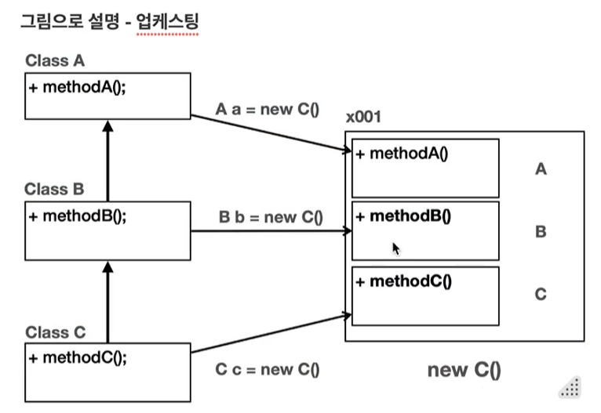

# Section10\_다형성

## 다형성

- 다양한 형태, 여러 형태를 의미
- 프로그래밍에서는 한 객체가 여러 타입의 객체로 취급될 수 있는 능력을 의미
- 두 가지 개념을 알아서 이해 가능
  - 다형적 참조
  - 메서드 오버라이딩

## 다형적 참조

- 부모 타입의 변수는 자식 인스턴스를 참조할 수 있다.
- 다양한 형태를 참조할 수 있다고 해서 이를 다형적 참조라고 한다.
  - `Parent poly = new Child();` // 성공
  - 하지만 자식의 기능은 호출할 수 없다.
- 반대로 자식 타입은 부모 타입을 담을 수 없다
  - `Child child1 = new Paret()` // 컴파일 오류 발생

### 다형적 참조의 한계

- Parent poly = new Child(); 인 상황
  - poly.childMethod() 실행하면 어떻게 될까?
  - poly가 Parent 타입이므로 Parent 클래스에서 먼저 참조함
  - 이후에 없으면 다른 곳을 순회하는데, 자식 → 부모는 참조가 가능하지만 반대는 불가능
  - 만약 자식 클래스의 메서드를 사용하고 싶다면 캐스팅을 사용해야 한다.

## 다형성과 캐스팅

- 부모 클래스에서 자식 클래스로 다형적 참조를 할 수는 있지만 자식 클래스의 메서드를 사용할 수는 없다.
- 이런 경우에 사용하기 위해서 캐스팅(형 변환)을 사용할 수 있다.
- 부모 → 자식의 경우 다운 캐스팅이라고 한다.
  - `Parent poly = new Child();`
  - `Child child = (Child) poly;`
  - 참조값을 대입하는 것이지 실제 Parent poly의 타입을 변하는 것은 아니다.
- 자식 → 부모의 경우 업캐스팅이라고 한다.

## 캐스팅의 종류

### 일시적 다운캐스팅

- 해당 메서드를 호출하는 순간만 다운캐스팅
  - `((Child) poly).childMethod();`

### 업캐스팅

- 자식 클래스가 부모 클래스로 다형적 참조한 경우를 의미한다
- `Child child = new Child();`
- `Parent parent1 = (Parent) child //업캐스팅은 생략 가능/권장`

## 다운캐스팅과 주의점

- Parent parent2 = new Parent();
- Child child2 = (Child) parent2;
- Parent 클래스로 생성하면 parent2에는 child 클래스가 없으므로 다운 캐스팅을 해도 Child의 메소드를 사용하지 못한다.
- ClassCastException 에러를 발생시킨다.



- 업캐스팅 할 때는 자식 클래스를 생성할 때 부모 클래스도 모두 생성되므로 문제가 생길 수가 없다.
- 하지만 다운캐스팅할 경우에는 자식 클래스가 생성이 안 됐을 경우도 있기 때문에 에러를 조심해야 한다.

## 컴파일 오류 VS 런타임 오류

- 컴파일 오류
  - 변수명 오타, 잘못된 클래스 사용 등 IDE에서 즉시 확인할 수 있는 좋은 오류
- 런타임 오류
  - 프로그램이 실행되고 있는 시점에서 발생하는 오류

## instanceof

```java
public class CasingMain {

    public static void main(String[] args) {
        Parent parent = new Parent();
        call(parent1);

        Parent parent2 = new Child();
        call(parent2);
    }

    private staic void call(Parent parent) {
        if (parent instanceof Child) {
            System.out.println("Child 인스턴스 맞음");
            Child child = (Chlid) parent;
            chlid.childMethod();
        } else {
            System.out.println("Child 인스턴스 아님");
        }
    }
}
```

- 오른쪽 타입에 왼쪽 타입의 들어갈 수 있으면 true 반환 아니면 false 반환
  - parent가 Child 클래스면 true를 반환하는 메소드
- 다운캐스팅을 수행하는 경우에는 위 코드처럼 instanceof 메소드를 통해서 변경이 가능한지 확인을 하고 수행하는 것이 안전하다.

### Pattern Matching for instanceof

- 자바 16부터는 instanceof를 사용하면서 동시에 변수를 선언할 수 있다.

  ```java
  private staic void call(Parent parent) {
          if (parent instanceof Child child) {
              System.out.println("Child 인스턴스 맞음");
              chlid.childMethod();
          }
      }

  ```

## 다형성과 메서드 오버라이딩

- 다형성에서 중요한 또다른 핵심은 메서드 오버라이딩이다
- 가장 중요한 점은
  - 오버라이딩된 메서드가 항상 우선권을 가진다는 것이다.


- `Parent poly = new Child();` 일 때,
  - poly.value는 호출한 클래스인 Parent 클래스 먼저 순회하여 반환한다.
  - 하지만 poly.method() 는 하위 타입인 Child에서 오버라이딩 되어 있기 때문에 하위 타입으로 실행된다.
  - **항상 오버라이딩 된 메서드가 우선권을 가진다**
