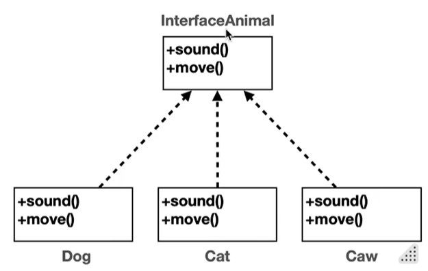

# Section11\_다형성 활용

## 다형성 활용

```java
public class AnimalPolyMain {

    public static void main(String[] args) {
        Dog dog = new Dog();
        Cat cat = new Cat();
        Cow cow = new Cow();

        soundAnimal(dog);
        soundAnimal(cat);
        soundAnimal(cow);
    }

    public static void soundAnimal(Animal animal) {
        System.out.println("동물 소리 테스트 시작");
        animal.sound();
        System.out.println("동물 소리 테스트 종료");
    }
}
```

- **다형적 참조** 덕분에 animal 변수는 자식인 Dog, Cat, Cow의 인스턴스를 참조 가능
- **메서드 오버라이딩** 덕분에 animal.sound()를 호출해도 각각의 인스턴스 메서드 호출

```java
public class AnimalPolyMain {

    public static void main(String[] args) {
        Animal[] animalArr = {new Dog(), new Cat(), new Cow()};

        for (Animal animal : animalArr) {
            soundAnimal(animal);
        }
    }

    private static void soundAnimal(Animal animal) {
        System.out.println("동물 소리 테스트 시작");
        animal.sound();
        System.out.println("동물 소리 테스트 종료");
    }
}
```

- 반복문과 배열을 통해서 확장성 있고 간단한 코드로 축약할 수 있다.
- ctrl + alt + N
  - 여러 곳에 있는 변수를 하나로 모을 때 사용
    - `Animal[] animalArr = {new Dog(), new Cat(), new Cow()};`
- ctrl + alt + M
  - 코드를 가지고 함수로 추출해낼 때 사용
    - 반복문 안에 있는 코드를 soundAnimal로 추출해냄
- 새로운 기능이 추가되었을 대 변하는 부분을 최소화 하는 것이 잘 작성된 코드
  - 변하는 부분과 변하지 않는 부분을 명확하게 구분하는 것이 중요

### 남은 문제

- Animal 클래스를 생성할 수 있는 문제
  - Animal 클래스는 추상화된 클래스라서 실제로 존재하는 것이 이상하다
  - 하지만 이것도 실제로 존재하는 클래스이므로 누군가 인스턴스를 생성할 수 있다.
- Animal 클래스를 상속 받는 곳에서 sound() 메서드 오버라이딩을 하지 않을 가능성
  - 새로운 자식 클래스를 생성해서 프로그램을 시작할 때
    - 까먹고 오버라이딩을 하지 않아도 부모의 메서드가 실행되므로 알 수 가 없다.
    - 좋은 프로그램은 제약이 있는 프로그램이므로 이 두 가지 문제를 해결하는 방법이 필요하다.

## 추상화

- 추상 클래스
  - 동물과 같이 부모 클래스는 제공하지만, 실제 생성되면 안되는 클래스
  - `abstract class AbstractAnimal`
    - 기존 클래스와 완전히 같지만 직접 인스턴스를 생성하지 못하는 제약이 있다.
- 추상 메서드
  - `public abstract void sound();`
  - 추상 메서드가 하나라도 있는 클래스는 추상 클래스로 선언해야 한다.
  - 상속 받는 클래스가 반드시 오버라이딩 해야 하는 메서드
  - 실체가 존재하지 않고 메서드 바디가 없다
- 순수 추상 클래스
  - 추상 클래스 안의 모든 메서드가 추상 메서드인 경우
  - 인스턴스를 생성할 수 없다.
  - 상속 시 자식은 모든 메서드를 오버라이딩 해야 한다.
  - 주로 다형성을 위해 사용된다.
  - 하지만 현재 자바에서는 인터페이스라는 기능을 사용해서 순수 추상 클래스를 사용하지 않는다.

## 인터페이스

```java
public class InterfaceMain {
    public interface InterfaceAnimal{
        void sound(); //interface는 abstract 생략 가능
    }
}
```

- 순수 추상 클래스의 특징을 모두 가지고 있음
  - 인스턴스 생성 불가
  - 상속시 모든 메서드 오버라이딩
  - 주로 다형성을 위해 사용
- 인터페이스만의 편의 기능이 더 있음
  - 모든 메서드가 public abstract이다
    - 그래서 생략이 가능 / 권장
  - 다중 구현, 다중 상속을 지원

```java
public class InterfaceMain {
    int MY_PI = 3.14;
}
```

- 인터페이스에도 멤버 변수 선언 가능
- 인터페이스의 필드는 public, static, final이 모두 포함
- 그래서 모두 상수 이므로 public static final은 생략 가능 / 권장



- 클래스 상속 관계는 UML에서 실선을 사용한다
- 하지만 인터페이스의 구현(상속) 관계는 점선을 사용한다.
  - 인터페이스를 구현할 때는 extends가 아니라 implement를 사용
- 클래스, 추상 클래스, 인터페이스는 모두 프로그램 코드, 메모리 구조상 똑같다
- 인터페이스를 사용하는 이유
  - 제약
    - 순수 추상 클래스를 오직 다형성을 위해서 만들었다고 해도, 안에 추상이 아닌 메서드를 만들 수 있다.
    - 하지만 인터페이스는 무조건 추상 메서드만 만들 수 있으므로 의도를 확실히 할 수 있다.
  - 다중 구현
    - 클래스 상속은 부모를 하나만 지정할 수 있다.
    - 인터페이스는 부모를 여러 명 두는 다중 구현(다중 상속)이 가능하다.

## 인터페이스 - 다중 구현

- 클래스에서는 다중 상속을 받을 경우 똑같은 메서드를 상속 받게 되면 어떤 메서드를 사용해야 할지 알 수가 없다.
- 하지만 인터페이스에서 다중 구현을 해도, 어차피 실제로 메서드를 작성하는 건 자식 클래스이기 때문에 중복되어도 문제가 없다.

## 클래스와 인터페이스 활용

- 하나의 클래스에서 클래스 상속와 인터페이스 구현을 동시에 하는 경우
- 상속은 하나만 가능하므로 여러 개를 받는 경우 클래스 먼저 사용해야 한다.
