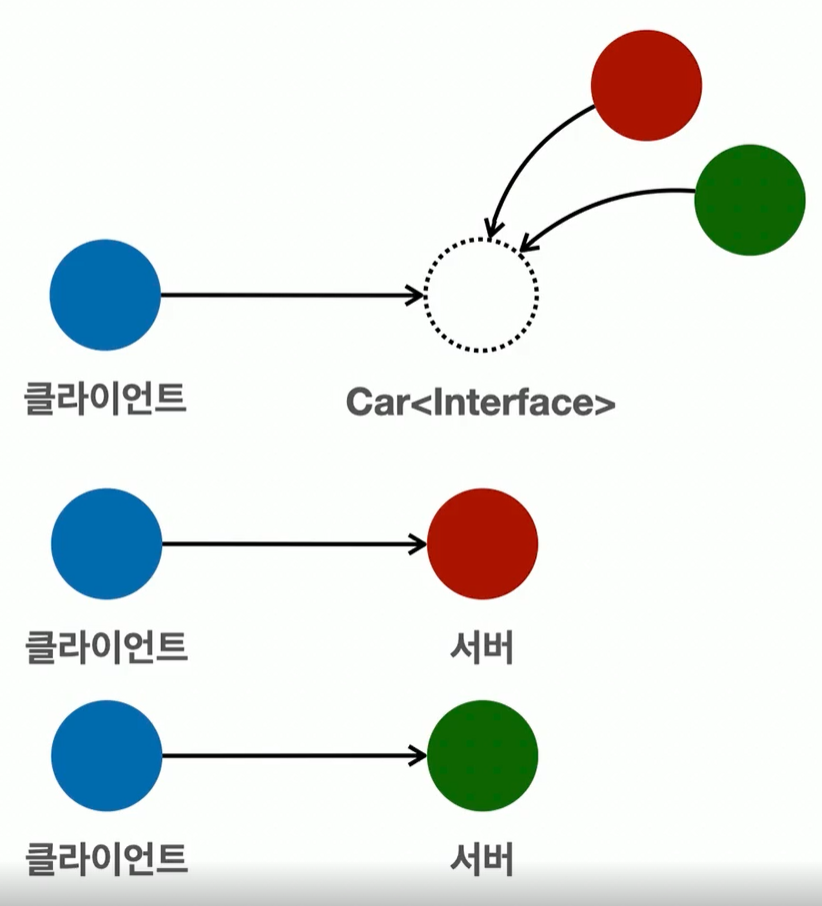

# Section 12\_다형성과 설계

## 객체 지향 프로그래밍

- 프로그램을 명령어의 목록으로 보는 시각에서 벗어나 객체들의 모임을 파악
- 각각의 객체는 메시지를 주고받고 데이터를 처리할 수 있음
- 프로그램을 유연하고 변경이 용이하게 만듬
  - 컴포넌트를 쉽고 유연하게 변경하면서 개발할 수 있는 방법

→ 이렇게 만드는 것이 **다형성(Polymorphism)**

- 역할과 구현을 분리
  - 역할과 구현을 구분하면 세상이 단순해지고 유연해지며 변경도 편리해진다.
    - 장점
      - 클라이언트는
        - 대상의 역할(인터페이스)만 알면 된다.
        - 구현 대상의 내부 구조를 몰라도 된다.
        - 구현 대상의 내부 구조가 변경되어도 영향을 받지 않는다.
        - 대상 자체를 변경해도 영향을 받지 않는다.
    - 한계
      - 역할(인터페이스)가 변하면 클라이언트, 서버 모두에 큰 변경이 발생
      - 그래서 인터페이스를 안정적을 잘 설계하는 것이 중요
- 자바 언어에서는?
  - 자바 언어의 다형성을 활용
  - 역할 - 인터페이스
  - 구현 - 인터페이스를 구현한 클래스, 구현 객체
  - 객체를 설계할 때 역할과 구현을 명확히 분리
  - 객체 설계시 역할(인터페이스)를 먼저 부여하고, 그 역할을 수행하는 구현 객체 만들기
- 객체의 협력이라는 관계부터 생각
  
  - 혼자 있는 객체는 없다
  - 클라이언트: 요청, 서버: 응답
  - 수 많은 객체 클라이언트와 객체 서버는 서로 협력 관계를 가진다.
  
  - 다형성의 본질
    - 인터페이스를 구현한 객체 인스턴스를 실행 시점에 유연하게 변경 가능
    - 다형성의 본질을 이해하려면 협력이라는 객체 사이의 관계에서 시작
    - 클라이언트를 변경하지 않고, 서버의 구현 기능을 유연하게 변경할 수 있음
- 객체 지향 프로그래밍의 정수는 **다형성**
- 디자인 패턴 대부분은 다형성을 활용
- 스프링의 핵심인 제어의 역전(IoC), 의존관계 주입(DI)도 다형성을 활용

## 다형성 - 역할과 구현 예제

```java
// 인터페이스 생성
public interface Car {
    void startEngine();

    void offEngine();

    void pressAccelerator();
}
```

```java
// Car 구현한 K3 클래스 생성
public class K3Car implements Car {
    @Override
    public void startEngine() {
        System.out.println("K3Car.startEngine");
    }

    @Override
    public void offEngine() {
        System.out.println("K3Car.offEngine");
    }

    @Override
    public void pressAccelerator() {
        System.out.println("K3Car.pressAccelerator");
    }
}
```

```java
// Car 구현한 Model3 생성
public class Model3Car implements Car {
    @Override
    public void startEngine() {
        System.out.println("Model3Car.startEngine");
    }

    @Override
    public void offEngine() {
        System.out.println("Model3Car.offEngine");
    }

    @Override
    public void pressAccelerator() {
        System.out.println("Model3Car.pressAccelerator");
    }
}
```

```java
// Car를 이용하는 클라이언트 클래스
public class Driver {

    private Car car;

    public void setCar(Car car) {
        System.out.println("자동차를 설정합니다: " + car);
        this.car = car;
    }

    public void drive() {
        System.out.println("자동차를 운전합니다.");
        car.startEngine();
        car.pressAccelerator();
        car.offEngine();
    }
}
```

```java
// 메인 메소드
public class CarMain1 {

    public static void main(String[] args) {
        Driver driver = new Driver();

        K3Car k3Car = new K3Car();
        driver.setCar(k3Car);
        driver.drive();

        Model3Car model3Car  = new Model3Car();
        driver.setCar(model3Car);
        driver.drive();
    }
}
```

- 클라이언트 코드를 변경하지 않고 Car를 바꿔가면서 사용이 가능
- 굉장히 유연하고 편리한 코드를 작성할 수 있음

## OCP(Open-Closed Principle) 원칙

- 좋은 객체 지향 설계 원칙 중 하나
- Open for extension
  - 새로운 기능의 추가나 변경 사항이 생겼을 때, 기존 코드는 확장할 수 있어야한다.
- Closed for modificaton
  - 기존의 코드는 수정되지 않아야 한다.
- 기존의 코드 수정 없이 새로운 기능을 추가할 수 있다는 의미
- 예제를 통한 의미 설명
  - 확장에 열려있다는 의미
    - Car 인터페이스를 사용해서 새로운 차량을 자유롭게 추가 가능
    - Driver 클래스도 Car 인터페이스를 통해 추가된 차량을 자유롭게 호출 가능
  - 코드 수정은 닫혀 있다는 의미
    - 확장하게 되면 기존 코드의 수정은 불가피하다
    - 변하지 않는 부분
      - 새로운 자동차를 추가할 때 가장 영향을 받는 클라이언트는 Car의 기능을 사용하는 Driver
        - Driver의 코드를 수정하지 않아도 된다는 의미
    - 변하는 부분
      - main 메소드와 같이 새로운 차를 생성하고 Driver에게 차를 전달해주는 역할은 당연히 코드 수정 필요
      - 전체 프로그램을 설정하고 조율하는 역할을 하기 때문
- 전략 패턴
  - 디자인 패턴 중에 가장 중요한 패턴 중 하나
  - 알고리즘을 클라이언트 코드의 변경 없이 쉽게 교체할 수 있다
