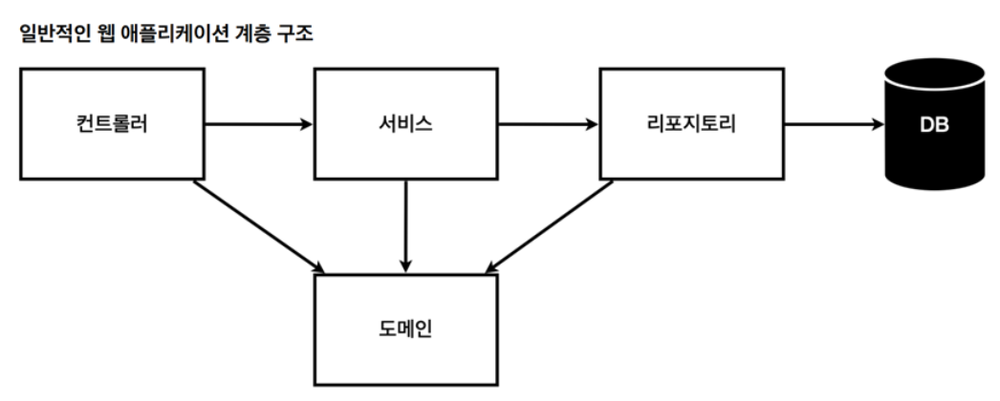
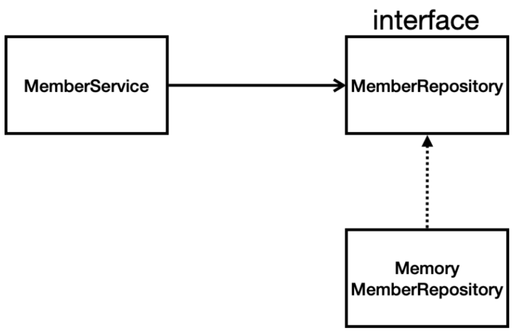

## 비즈니스 요구사항 정리

- 데이터
  - 회원ID
  - 이름
- 기능
  - 회원 등록
  - 조회
- 데이터 저장소가 선정되지 않음(가상의 시나리오)
  - NOSQL, RDBMS 등 결정이 안 된 상태



- 컨트롤러
  - 웹 MVC의 컨트롤러 역할
- 서비스
  - 핵심 비즈니스 로직 구현 (회원가입은 중복 불가 등등)
- 리포지토리
  - 데이터베이스에 접근, 도메인 객체를 저장하고 관리
- 도메인
  - 비즈니스 도메인 객체, 예) 회원, 주문, 쿠폰, 등등 주로 데이터베이스에 저장하고 관리됨
  
- **클래스 의존 관계**
  - 아직 데이터 저장소가 선정되지 않아서 인터페이스로 구현 클래스를 변경할 수 있도록 설계
  - 개발을 진행하기 위해서 초기 개발 단계에서는 구현체로 가벼운 메모리 기반의 데이터 저장소 사용
    - hashmap 이용

## 회원 도메인과 리포지토리 만들기

- 회원 객체
  - 요구 사항에 적힌 것과 같이 id와 name 필드 생성
  - name은 사용자가 직접 입력하지만 id는 시스템에서 지정

```java
package hello.hellospring.domain;

public class Member {

    private Long id;
    private String name;

    public Long getId() {
        return id;
    }

    public void setId(Long id) {
        this.id = id;
    }

    public String getName() {
        return name;
    }

    public void setName(String name) {
        this.name = name;
    }
}
```

- 회원 리포지토리 인터페이스

```java
package hello.hellospring.repository;

import hello.hellospring.domain.Member;

import java.util.List;
import java.util.Optional;

public interface MemberRepository {
    Member save(Member member);

    Optional<Member> findById(Long id);

    Optional<Member> fingByName(String name);

    List<Member> findAll();
}
```

- 회원 리포지토리 메모리 구현체

```java
package hello.hellospring.repository;

import hello.hellospring.domain.Member;

import java.util.*;

// 동시성 문제가 고려되어 있지 않음
// 실무에서는 이를 고려하여 ConcurentHashmap과 AtomicLong 사용 고려

public class MemoryMemberRepository implements MemberRepository {

    private static Map<Long, Member> store = new HashMap<>();
    private static long sequence = 0L;

    @Override
    public Member save(Member member) {
        member.setId(++sequence);
        store.put(member.getId(), member);
        return member;
    }

    @Override
    public Optional<Member> findById(Long id) {
        return Optional.ofNullable(store.get(id));
    }

    @Override
    public Optional<Member> findByName(String name) {
        return store.values().stream()
                .filter(member -> member.getName().equals(name))
                .findAny();
    }

    @Override
    public List<Member> findAll() {
        return new ArrayList<>(store.values());
    }

}
```

- Optional 설명
  - NULL 값이 반환될 때 단순히 NULL로 처리하는 게 아니게 하는 방법

```java
@Override
    public Optional<Member> findByName(String name) {
        return store.values().stream()
                .filter(member -> member.getName().equals(name))
                .findAny();
    }
```

- 함수 설명
  - **스트림 생성**
    - **`store.values().stream()`** 부분은 **`store`**에서 **`Member`** 객체들의 컬렉션을 스트림으로 변환
    - 스트림은 데이터 컬렉션을 함수형 스타일로 처리할 수 있게 해주는 일련의 연산들을 제공
  - **필터링**
    - **`.filter(member -> member.getName().equals(name))`** 이 부분은 스트림의 각 요소(여기서는 **`Member`** 객체)에 대해 필터를 적용
    - 람다 표현식 **`member -> member.getName().equals(name)`**은 각 **`Member`** 객체의 **`getName()`** 메서드로 반환된 이름이 인자로 받은 **`name`**과 같은지 비교
    - 이 조건을 만족하는 요소만 다음 단계로 넘어감
  - **조건에 맞는 요소 찾기**
    - **`.findAny()`** 메서드는 필터를 통과한 요소 중 하나를 선택
    - 이는 병렬 처리에서 특히 유용하며, 스트림의 어떤 요소든 상관없이 하나만 필요할 때 사용됩니다. **`Optional<Member>`** 타입을 반환
    - 조건을 만족하는 **`Member`** 객체가 있으면 담고, 없으면 **`Optional.empty()`**를 반환
- **스트림**
  - 컬렉션(예: 리스트, 집합)의 요소를 추상화하여 쉽게 처리할 수 있게 하는 인터페이스
  - 스트림을 사용하면 데이터 컬렉션을 선언적으로 처리
  - 람다 표현식과 함께 사용하여 코드의 간결성과 가독성을 크게 향상
  - 스트림의 특징
    - **선언적 처리**
      - 데이터를 어떻게 처리할지에 대한 선언적인 접근 방식을 제공하여, 개발자가 '무엇을' 할 것인지에 집중할 수 있게 함
      - 이는 '어떻게' 처리할 것인지에 대한 저수준의 세부 사항에서 벗어나게 해준다.
    - **파이프라이닝**
      - 스트림 연산들은 파이프라인을 형성할 수 있으며
      - 이는 여러 연산들을 연결하여 복잡한 데이터 처리 파이프라인을 구성할 수 있음을 의미
      - 각 연산은 이전 연산의 결과를 다음 연산으로 전달합니다.
    - **내부 반복**
      - 개발자가 명시적으로 요소를 반복 처리하는 코드를 작성할 필요 없이, 스트림이 알아서 처리
    - **함수형 프로그래밍과 호환성**
      - 스트림은 함수형 인터페이스와 람다 표현식을 사용하여 연산을 수행함으로써, 함수형 프로그래밍 스타일을 자바에 적용
    - **병렬 처리 용이**
      - 스트림은 병렬 처리를 매우 쉽게 할 수 있도록 지원
      - 데이터가 큰 컬렉션을 처리할 때 성능을 향상
      - **`.parallelStream()`** 메서드를 통해 손쉽게 병렬 스트림을 생성할 수 있습니다.
- **람다식**
  - 간결한 방식으로 함수형 인터페이스(단 하나의 추상 메서드를 가진 인터페이스)의 구현
  - 람다 식은 **`(매개변수) -> { 표현식; }`**의 형태를 가지며, 메서드의 이름과 반환 타입을 명시할 필요가 없어 코드를 더 간결하게 함
  - **예제**
    ```java
    (int a, int b) -> { return a + b; }
    ```
    - **`(int a, int b)`**는 람다 표현식의 매개변수
    - `→` 기호는 람다 표현식의 시작.
    - **`{ return a + b; }`**는 실제 람다 표현식의 본체로, 실행될 코드.

## 회원 리포지토리 테스트 케이스 작성

- 테스트 할 때 보통
  - 자바의 main 메서드를 통해서 실행
  - 컨트롤러를 통해 실행
- 하지만 오래 걸리고 반복 실행하기 어렵다는 단점 존재
- 그래서 JUnit이라는 프레임워크로 테스트 실행

```java
package hello.hellospring.repository;
class MemoryMemberRepositoryTest {

    MemoryMemberRepository repository = new MemoryMemberRepository();
// 각 테스트를 진행할 때 DB에 직전 테스트 결과를 제거하는 메소드
    @AfterEach
    public void afterEach() {
        repository.clearStore();
    }

    @Test
    public void save() {
        Member member = new Member();
        member.setName("spring");

        repository.save(member);

        Member result = repository.findById(member.getId()).get();
// 아래의 3줄은 같은 기능을 하는 코드
// 주로 3번 줄의 코드를 많이 사용
        System.out.println("result = " + (result == member));
        Assertions.assertEquals(result, member);
        assertThat(member).isEqualTo(result);
    }

    @Test
    public void findByName() {
        Member member1 = new Member();
        member1.setName("spring1");
        repository.save(member1);

        Member member2 = new Member();
        member2.setName("spring2");
        repository.save(member2);

        Member result = repository.findByName("spring1").get();

        assertThat(result).isEqualTo(member1);
    }

    @Test
    public void findAll() {
        Member member1 = new Member();
        member1.setName("spring1");
        repository.save(member1);

        Member member2 = new Member();
        member2.setName("spring2");
        repository.save(member2);

        List<Member> result = repository.findAll();

        assertThat(result.size()).isEqualTo(2);

    }
}
```

## 회원 서비스 개발

```java
package hello.hellospring.service;

public class MemberService {

    private final MemberRepository memberRepository = new MemoryMemberRepository();

    // 회원 가입
    public Long join(Member member) {

        validateDuplicateMember(member); // 중복 회원 검증
        memberRepository.save(member);
        return member.getId();
    }

    private void validateDuplicateMember(Member member) {
        memberRepository.findByName(member.getName())
				// Optional이라서 null일 때가 아니라 존재할 때를 의미하는 메서드를 사용 가능
                .ifPresent(m -> {
                    throw new IllegalStateException("이미 존재하는 회원입니다");
                });
    }

    // 전체 회원 조회
    public List<Member> findMembers() {
        return memberRepository.findAll();
    }

    public Optional<Member> findOne(Long memberId) {
        return memberRepository.findById(memberId);
    }
}
```

## 회원 서비스 테스트

```java
package hello.hellospring.service;

class MemberServiceTest {

    MemberService memberService;
    MemoryMemberRepository memberRepository;

		// 같은 레포지토리를 사용하기 위해서 테스트 실행 전 생성자를 통해 같은 레포지토리로 초기화
    @BeforeEach
    public void beforeEach() {
        memberRepository = new MemoryMemberRepository();
        memberService = new MemberService(memberRepository);
    }

    @AfterEach
    public void afterEach() {
        memberRepository.clearStore();
    }

    @Test
    void join() {

        //given (주어진 조건)
        Member member = new Member();
        member.setName("hello");

        //when (주어진 상황)
        Long saveId = memberService.join(member);

        //then (어떤 걸 테스트 하고 싶은 지)
        Member findMember = memberService.findOne(saveId).get();
        assertThat(member.getName()).isEqualTo(findMember.getName());
    }

    @Test
    public void 중복_회원_예외() {
        //given
        Member member1 = new Member();
        member1.setName("spring");

        Member member2 = new Member();
        member2.setName("spring");

        //when
        memberService.join(member1);
        IllegalStateException e = assertThrows(IllegalStateException.class,
                () -> memberService.join(member2));
				//then (어떤 걸 테스트 하고 싶은 지)
        assertThat(e.getMessage()).isEqualTo("이미 존재하는 회원입니다.");

// 아래 코드도 맞는 방법이나 간단하게 쓰기 위해서 assertThorws 메서드를 사용
//        memberService.join(member1);
//        try {
//            memberService.join(member2);
//        } catch (IllegalStateException e) {
//            assertThat(e.getMessage()).isEqualTo("이미 존재하는 회원입니다.");
//        }
    }
}
```
