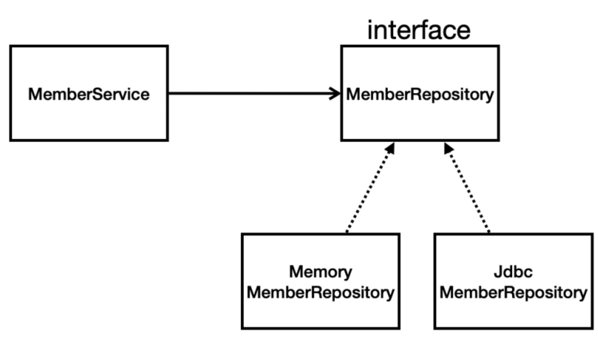
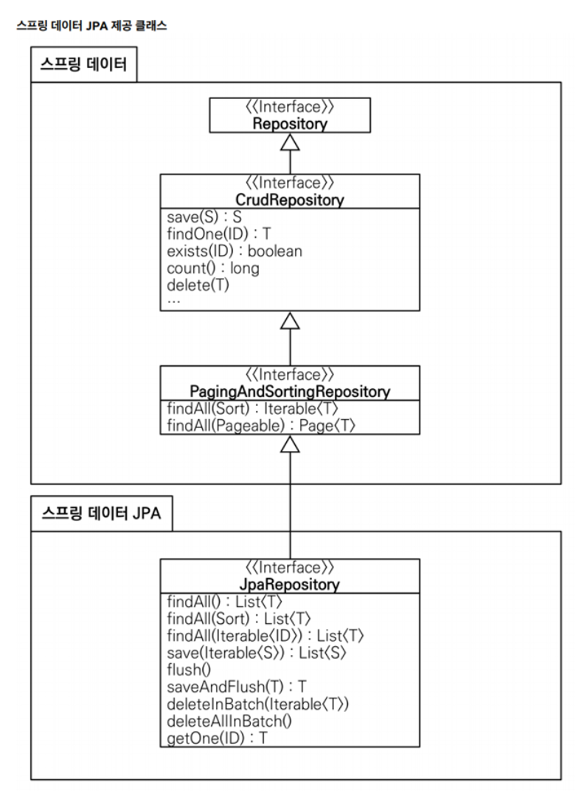

# Section06\_스프링 DB 접근 기술

## H2 데이터베이스 설치

- 간단한 테스트용 DB
- 윈도우 기준 실행 방법
  - ./h2.bat
  - jdbc:h2~test (최초 한 번)
  - ~/test.mv.db 파일 생성 확인
  - 이후에는 jdbc:h2:tcp://localhost/~/test 사용
- 테이블 관리를 위해 project root 경로에 sql/ddl.sql 패키지 생성
- 실제 DB에도 입력

```java
drop table if exists member CASCADE;
create table member
(
    id   bigint generated by default as identity,
    name varchar(255),
    primary key (id)
    );
```

## 순수 Jdbc

- build.grade 파일에 jdbc, h2 데이터베이스 관련 라이브러리 추가
  ```java
  implementation 'org.springframework.boot:spring-boot-starter-jdbc'
  runtimeOnly 'com.h2database:h2'
  ```
- 스프링 부트 데이터베이스 연결 설정 추가

```java
spring.datasource.url=jdbc:h2:tcp://localhost/~/test
spring.datasource.driver-class-name=org.h2.Driver
spring.datasource.username=sa
```

- Jdbc 회원 리포지토리 / 현재는 사용 안하므로 그냥 이런 게 있구나~ 정도만 참고
  ```java
  package hello.hellospring.repository;

  import hello.hellospring.domain.Member;
  import org.springframework.jdbc.datasource.DataSourceUtils;
  import javax.sql.DataSource;
  import java.sql.*;
  import java.util.ArrayList;
  import java.util.List;
  import java.util.Optional;public class JdbcMemberRepository implements MemberRepository {
      private final DataSource dataSource;
      public JdbcMemberRepository(DataSource dataSource) {
          this.dataSource = dataSource;
      }
      @Override
      public Member save(Member member) {
          String sql = "insert into member(name) values(?)";
          Connection conn = null;
          PreparedStatement pstmt = null;
          ResultSet rs = null;
          try {
              conn = getConnection();
              pstmt = conn.prepareStatement(sql, Statement.RETURN_GENERATED_KEYS);
              pstmt.setString(1, member.getName());
              pstmt.executeUpdate();
              rs = pstmt.getGeneratedKeys();
              if (rs.next()) {
                  member.setId(rs.getLong(1));
              } else {
                  throw new SQLException("id 조회 실패");
              }
              return member;
          } catch (Exception e) {
              throw new IllegalStateException(e);
          } finally {
              close(conn, pstmt, rs);
          }
      }
      @Override
      public Optional<Member> findById(Long id) {
          String sql = "select * from member where id = ?";
          Connection conn = null;PreparedStatement pstmt = null;
          ResultSet rs = null;
          try {
              conn = getConnection();
              pstmt = conn.prepareStatement(sql);
              pstmt.setLong(1, id);
              rs = pstmt.executeQuery();
              if(rs.next()) {
                  Member member = new Member();
                  member.setId(rs.getLong("id"));
                  member.setName(rs.getString("name"));
                  return Optional.of(member);
              } else {
                  return Optional.empty();
              }
          } catch (Exception e) {
              throw new IllegalStateException(e);
          } finally {
              close(conn, pstmt, rs);
          }
      }
      @Override
      public List<Member> findAll() {
          String sql = "select * from member";
          Connection conn = null;
          PreparedStatement pstmt = null;
          ResultSet rs = null;
          try {
              conn = getConnection();
              pstmt = conn.prepareStatement(sql);
              rs = pstmt.executeQuery();
              List<Member> members = new ArrayList<>();
              while(rs.next()) {Member member = new Member();
                  member.setId(rs.getLong("id"));
                  member.setName(rs.getString("name"));
                  members.add(member);
              }
              return members;
          } catch (Exception e) {
              throw new IllegalStateException(e);
          } finally {
              close(conn, pstmt, rs);
          }
      }
      @Override
      public Optional<Member> findByName(String name) {
          String sql = "select * from member where name = ?";
          Connection conn = null;
          PreparedStatement pstmt = null;
          ResultSet rs = null;
          try {
              conn = getConnection();
              pstmt = conn.prepareStatement(sql);
              pstmt.setString(1, name);
              rs = pstmt.executeQuery();
              if(rs.next()) {
                  Member member = new Member();
                  member.setId(rs.getLong("id"));
                  member.setName(rs.getString("name"));
                  return Optional.of(member);
              }
              return Optional.empty();
          } catch (Exception e) {
              throw new IllegalStateException(e);
          } finally {
              close(conn, pstmt, rs);
          }
      }private Connection getConnection() {
          return DataSourceUtils.getConnection(dataSource);
      }
      private void close(Connection conn, PreparedStatement pstmt, ResultSet rs) {
          try {
              if (rs != null) {
                  rs.close();
              }
          } catch (SQLException e) {
              e.printStackTrace();
          }
          try {
              if (pstmt != null) {
                  pstmt.close();
              }
          } catch (SQLException e) {
              e.printStackTrace();
          }
          try {
              if (conn != null) {
                  close(conn);
              }
          } catch (SQLException e) {
              e.printStackTrace();
          }
      }
      private void close(Connection conn) throws SQLException {
          DataSourceUtils.releaseConnection(conn, dataSource);
      }
  }
  ```
- 스프링 설정 변경

```java
package hello.hellospring;

import javax.sql.DataSource;

@Configuration
public class SpringConfig {

    private DataSource dataSource;

    @Autowired
    public SpringConfig(DataSource dataSource) {
        this.dataSource = dataSource;
    }

    @Bean
    public MemberService memberService() {
        return new MemberService(memberRepository());
    }

    @Bean
    public MemberRepository memberRepository() {
//      return new MemoryMemberRepository();
        return new JdbcMemberRepository(dataSource);
    }
}
```

- DataSource는 데이터베이스 커넥션을 획득할 때 사용하는 객체
- 스프링 부트는 데이터베이스 커넥션 정보를 바탕으로 DataSource를 생성하고 스프링 빈으로 만들어둔다.
  - 위의 설정 코드 부분
- 그래서 아래서 DI를 받는다



- 스프링의 DI를 사용하면 기존 코드를 전혀 손대지 않고 설정만으로 구현 클래스를 변경 가능

## 스프링 통합 테스트

```java
package hello.hellospring.service;

import hello.hellospring.domain.Member;
import hello.hellospring.repository.MemberRepository;
import hello.hellospring.repository.MemoryMemberRepository;
import org.junit.jupiter.api.AfterEach;
import org.junit.jupiter.api.BeforeEach;
import org.junit.jupiter.api.Test;
import org.springframework.beans.factory.annotation.Autowired;
import org.springframework.boot.test.context.SpringBootTest;
import org.springframework.transaction.annotation.Transactional;

import static org.assertj.core.api.AssertionsForClassTypes.assertThat;
import static org.junit.jupiter.api.Assertions.assertThrows;

@SpringBootTest
@Transactional
class MemberServiceIntegrationTest {

    @Autowired MemberService memberService;
    @Autowired MemberRepository memberRepository;

    @Test
    void join() {
        //given
        Member member = new Member();
        member.setName("hello");

        //when
        Long saveId = memberService.join(member);

        //then
        Member findMember = memberService.findOne(saveId).get();
        assertThat(member.getName()).isEqualTo(findMember.getName());
    }

    @Test
    public void 중복_회원_예외() {
        //given
        Member member1 = new Member();
        member1.setName("spring");

        Member member2 = new Member();
        member2.setName("spring");

        //when
        memberService.join(member1);
        IllegalStateException e = assertThrows(IllegalStateException.class,
                () -> memberService.join(member2));

        assertThat(e.getMessage()).isEqualTo("이미 존재하는 회원입니다.");
    }
}
```

- @SpringBootTest
  - 스프링 컨테이너와 테스트를 함께 실행
- @Transactional
  - 테스트 시작 전에 트랜잭션을 시작하고, 테스트 완료 후에 항상 롤백
    - 이렇게 하면 DB에 데이터가 남지 않으므로 다음 테스트에 영향을 주지 않는다.
- 대부분의 경우 단위 별로 유닛 테스트를 하는 게 좋은 테스트
  - 통합 테스트를 해야 하는 경우도 있지만 대부분의 경우 유닛 테스트가 좋다.

## 스프링 JdbcTemplate

- 스프링 JdbcTemplate 회원 레포지토리
  ```java
  package hello.hellospring.repository;

  import hello.hellospring.domain.Member;
  import org.springframework.beans.factory.annotation.Autowired;
  import org.springframework.jdbc.core.JdbcTemplate;
  import org.springframework.jdbc.core.RowMapper;
  import org.springframework.jdbc.core.namedparam.MapSqlParameterSource;
  import org.springframework.jdbc.core.simple.SimpleJdbcInsert;

  import javax.sql.DataSource;
  import java.sql.ResultSet;
  import java.sql.SQLException;
  import java.util.HashMap;
  import java.util.List;
  import java.util.Map;
  import java.util.Optional;

  public class JdbcTemplateMemberRepository implements MemberRepository {

      private final JdbcTemplate jdbcTemplate;
      public JdbcTemplateMemberRepository(DataSource dataSource) {
          jdbcTemplate = new JdbcTemplate(dataSource);
      }

      @Override
      public Member save(Member member) {
          SimpleJdbcInsert jdbcInsert = new SimpleJdbcInsert(jdbcTemplate);
          jdbcInsert.withTableName("member").usingGeneratedKeyColumns("id");

          Map<String, Object> parameters = new HashMap<>();
          parameters.put("name", member.getName());

          Number key = jdbcInsert.executeAndReturnKey(new MapSqlParameterSource(parameters));
          member.setId(key.longValue());
          return member;
      }

      @Override
      public Optional<Member> findById(Long id) {
          List<Member> result = jdbcTemplate.query("select * from member where id = ?", memberRowMapper(), id);
          return result.stream().findAny();
      }

      @Override
      public Optional<Member> findByName(String name) {
          List<Member> result = jdbcTemplate.query("select * from member where name = ?", memberRowMapper(), name);
          return result.stream().findAny();
      }

      @Override
      public List<Member> findAll() {
          return jdbcTemplate.query("select * from member", memberRowMapper());
      }

      private RowMapper<Member> memberRowMapper() {
          return (rs, rowNum) -> {
              Member member = new Member();
              member.setId(rs.getLong("id"));
              member.setName(rs.getString("name"));
              return member;
          };
      }
  }
  ```
- Jdbc Template을 사용하도록 스프링 설정 변경
  ```java
  package hello.hellospring;

  import hello.hellospring.repository.JdbcMemberRepository;
  import hello.hellospring.repository.JdbcTemplateMemberRepository;
  import hello.hellospring.repository.MemberRepository;
  import hello.hellospring.repository.MemoryMemberRepository;
  import hello.hellospring.service.MemberService;
  import org.springframework.beans.factory.annotation.Autowired;
  import org.springframework.context.annotation.Bean;
  import org.springframework.context.annotation.Configuration;

  import javax.sql.DataSource;

  @Configuration
  public class SpringConfig {

      private DataSource dataSource;

      @Autowired
      public SpringConfig(DataSource dataSource) {
          this.dataSource = dataSource;
      }

      @Bean
      public MemberService memberService() {
          return new MemberService(memberRepository());
      }

      @Bean
      public MemberRepository memberRepository() {
  //      return new MemoryMemberRepository();
  //      return new JdbcMemberRepository(dataSource);
          return new JdbcTemplateMemberRepository(dataSource);
      }
  }
  ```
- 현업에서 프로덕트의 크기가 커질수록 테스트 케이스 작성을 잘해야 한다.
- 실제로 근무시간의 6~70%는 테스트 케이스를 작성하고, 3~40%만 프로덕트 코드를 짜는 개발자 분들이 많다

## JPA

- JPA는 기존의 반복 코드는 물론이고 기본적인 SQL도 JPA가 직접 만들어서 실행
- JPA를 사용하면, SQL과 데이터 중심의 설계에서 객체 중심의 설계로 패러다임의 전환
- JPA를 사용하면 개발 생산성을 크게 높일 수 있다.
- build.gradle 파일에 JPA 관련 라이브러리 추가
  ```java
  dependencies {
  	implementation 'org.springframework.boot:spring-boot-starter-thymeleaf'
  	implementation 'org.springframework.boot:spring-boot-starter-web'
  //	implementation 'org.springframework.boot:spring-boot-starter-jdbc'
  	implementation 'org.springframework.boot:spring-boot-starter-data-jpa'
  	runtimeOnly 'com.h2database:h2'
  	testImplementation 'org.springframework.boot:spring-boot-starter-test'
  }
  ```
- 스프링 부트에 JPA 설정 추가 / resources/application.properties
  - show - sql
    - JPA가 생성하는 SQL 출력
  - ddl - auto
    - JPA가 자동으로 테이블을 생성하는 기능, 현재는 이미 생성해놓은 상태이므로 none
  ```java
  spring.datasource.url=jdbc:h2:tcp://localhost/~/test
  spring.datasource.driver-class-name=org.h2.Driver
  spring.datasource.username=sa
  spring.jpa.show-sql=true
  spring.jpa.hibernate.ddl-auto=none
  ```
- JPA entity mapping / domain 파일
  - Entity 애노테이션 사용
  - `@Id @GeneratedValue(strategy = GenerationType.IDENTITY)`
    - ID 자동 추가되는 전략을 의미
  ```java
  package hello.hellospring.domain;

  import jakarta.persistence.Entity;
  import jakarta.persistence.GeneratedValue;
  import jakarta.persistence.GenerationType;
  import jakarta.persistence.Id;
  import jdk.jfr.Enabled;

  @Entity
  public class Member {

      @Id @GeneratedValue(strategy = GenerationType.IDENTITY)
      private Long id;
      private String name;

      public Long getId() {
          return id;
      }

      public void setId(Long id) {
          this.id = id;
      }

      public String getName() {
          return name;
      }

      public void setName(String name) {
          this.name = name;
      }
  }
  ```
- JPA 회원 리포지토리
  ```java
  package hello.hellospring.repository;

  import hello.hellospring.domain.Member;
  import jakarta.persistence.EntityManager;

  import java.util.List;
  import java.util.Optional;

  public class JpaMemberRepository implements MemberRepository{

      private final EntityManager em;

      public JpaMemberRepository(EntityManager em) {
          this.em = em;
      }

      @Override
      public Member save(Member member) {
          em.persist(member);
          return member;
      }

      @Override
      public Optional<Member> findById(Long id) {
          Member member = em.find(Member.class, id);
          return Optional.ofNullable(member);
      }

      @Override
      public Optional<Member> findByName(String name) {
          List<Member> result = em.createQuery("select m from Member m where m.name = :name", Member.class)
                  .setParameter("name", name)
                  .getResultList();
          return result.stream().findAny();
      }

      @Override
      public List<Member> findAll() {
          return em.createQuery("select m from Member m", Member.class)
                  .getResultList();
      }
  }
  ```
- 서비스 계층에 트랜잭션 추가
  - 스프링은 해당 클래스의 메서드를 실행할 때 트랜잭션을 시작
  - 메서드가 정상 종료되면 트랜잭션을 커밋 / 런타임 예외가 발생하면 롤백
  - **JPA를 통한 모든 데이터 변경은 트랜잭션 안에서만 실행해야 한다.**
  ```java
  @Transactional
  public class MemberService {

      private final MemberRepository memberRepository;

      public MemberService(MemberRepository memberRepository) {
          this.memberRepository = memberRepository;
      }
  ```
- JPA 사용하도록 스프링 설정 변경
  ```java
  package hello.hellospring;

  import hello.hellospring.repository.*;
  import hello.hellospring.service.MemberService;
  import jakarta.persistence.EntityManager;
  import org.springframework.beans.factory.annotation.Autowired;
  import org.springframework.context.annotation.Bean;
  import org.springframework.context.annotation.Configuration;

  import javax.sql.DataSource;
  import javax.swing.text.html.parser.Entity;

  @Configuration
  public class SpringConfig {

      private EntityManager em;

      @Autowired
      public SpringConfig(EntityManager em) {
          this.em = em;
      }

      @Bean
      public MemberService memberService() {
          return new MemberService(memberRepository());
      }

      @Bean
      public MemberRepository memberRepository() {
  //        return new MemoryMemberRepository();
  //        return new JdbcMemberRepository(dataSource);
  //        return new JdbcTemplateMemberRepository(dataSource);
          return new JpaMemberRepository(em);
      }
  }
  ```

## 스프링 데이터 JPA

- 스프링 부트 + JPA만 사용해도 개발 생산성 ++
- 스프링 데이터 JPA까지 사용하면 리포지토리에 구현 클래스 없이 인터페이스 만으로도 개발을 완료 가능
- CRUD도 스프링 데이터 JPA가 제공
- 스프링 데이터 JPA 회원 리포지토리

```java
package hello.hellospring.repository;

import hello.hellospring.domain.Member;
import org.springframework.data.jpa.repository.JpaRepository;

import java.util.Optional;

public interface SpringDataJpaMemberRepository extends JpaRepository<Member, Long>, MemberRepository {

    @Override
    Optional<Member> findByName(String name);
}
```

- 스프링 데이터 JPA 회원 리포지토리를 사용하도록 스프링 설정 변경

```java
@Configuration
public class SpringConfig {

    private final MemberRepository memberRepository;

    @Autowired
    public SpringConfig(MemberRepository memberRepository) {
        this.memberRepository = memberRepository;
    }

    @Bean
    public MemberService memberService() {
        return new MemberService(memberRepository);
    }
}
```

- 스프링 데이터 JPA가 SpringDataJpaMemberRepository를 스프링 빈으로 자동 등록



- 스프링 데이터 JPA 제공 기능
  - 인터페이스를 통한 기본적인 CRUD
  - findByName(), findByEmail()처럼 메서드 이름 만으로 조회 기능 제공
  - 페이징 기능 자동 제공
