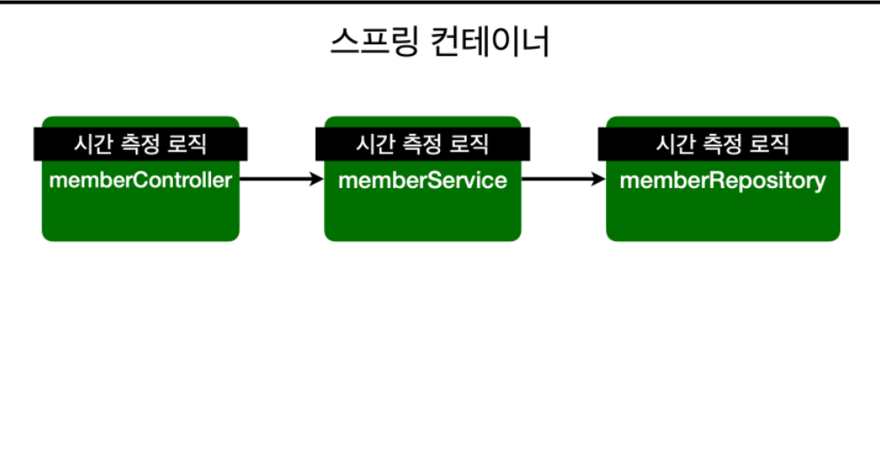
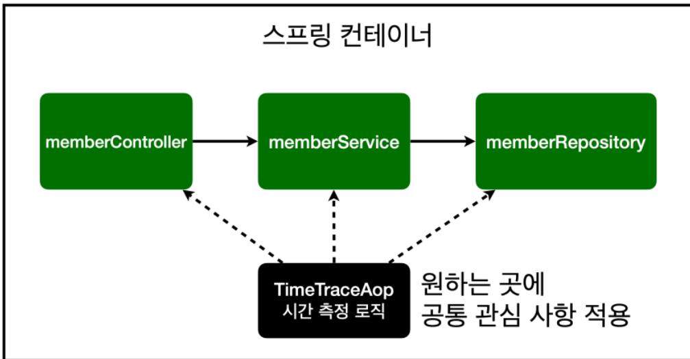
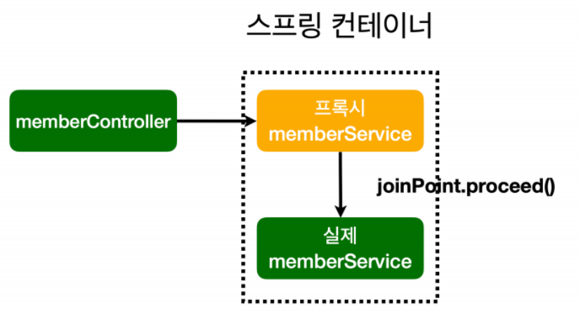

# Section07_AOP

## AOP가 필요한 상황

- 모든 메소드의 호출 시간을 측정하고 싶다면?
- 공통 관심 사항(cross-cutting concern) vs 핵심 관심 사항(core concer)
- 회원 가입 시간, 회원 조회 시간을 측정하고 싶다면?
  - 각각의 코드에 시간을 측정하는 기능을 넣었다고 가정
    
  - 회원가입, 회원 조회에 시간을 측정하는 기능은 핵심 관심 사항 X
  - 시간을 측정하는 로직은 공통 관심 사항
  - 시간을 측정하는 로직과 핵심 비즈니스 로직이 섞여서 유지보수가 어려움
  - 시간을 측정하는 로직을 별도의 공통 로직으로 만들기 어려움
  - 시간을 측정하는 로직을 변경할 때 모든 로직을 찾아가 변경

## AOP 적용

- AOP(Aspect Oriented Programming)
  
  ```java
  package hello.hellospring.aop;

  import org.aspectj.lang.ProceedingJoinPoint;
  import org.aspectj.lang.annotation.Around;
  import org.aspectj.lang.annotation.Aspect;
  import org.hibernate.annotations.Comment;
  import org.springframework.stereotype.Component;

  import javax.xml.transform.Result;

  @Aspect
  @Component
  public class TimeTraceAop {

      @Around("execution(* hello.hellospring..*(..))")
      public Object execute(ProceedingJoinPoint joinPoint) throws Throwable {
          long start = System.currentTimeMillis();
          System.out.println("START: " + joinPoint.toString());
          try {
              return joinPoint.proceed();
          } finally {
              long finish = System.currentTimeMillis();
              long timeMs = finish - start;
              System.out.println("END: " + joinPoint.toString() + " "+ timeMs + "ms");
          }

      }
  }
  ```
  - 시간을 측정하는 공통 관심 사항을 분리
  - 핵심 관심 사항을 깔끔하게 유지
  - 변경이 필요하면 이 로직만 변경
  - 원하는 적용 대상을 선택 가능
- 스프링의 AOP 동작 방식 설명
  - AOP 적용 전 의존관계
    
  - AOP 적용 후 의존관계
    
    - 전과 달리 컨트롤러에서 실제가 아닌 프록시에 있는 서비스를 사용하고 이후 실제 서비스로 넘어간다.
