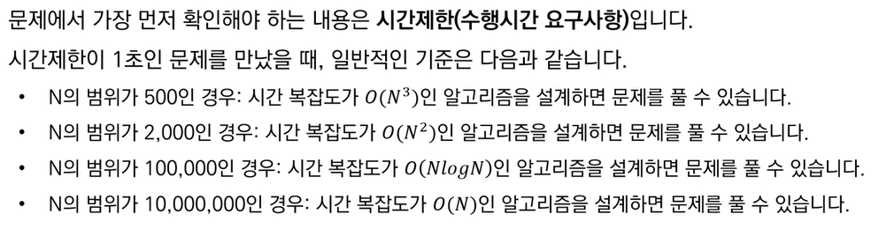
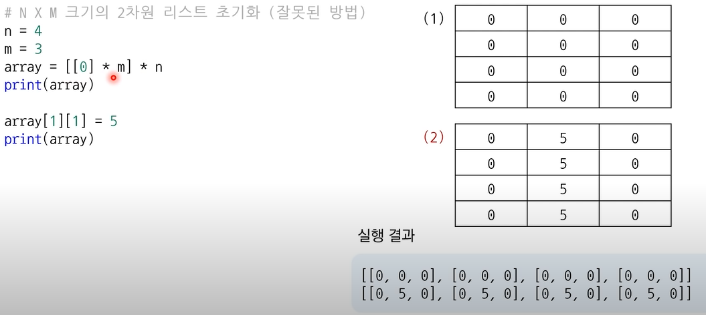

# 1강 개요 및 문법

## 코딩테스트 개요

- 자신만의 소스코드 관리하기
  - 팀 노드를 만드는 것을 추천
- 온라인 개발 환경 사용 추천
  - 리플릿

## 알고리즘 성능 평가

### 빅오 표기법


### 알고리즘 설계 tip

- python과 pypy의 경우 서로 시간 복잡도와 공간 복잡도가 반비례 하기 때문에 올바른 코드를 작성한 것 같다면 둘을 번갈아가면서 사용한다.
- 파이썬이 1초에 2천만(10의 7승) 번 계산 가능하다고 생각하고 설계
- 코딩 테스트 문제에서 시간 제한은 통상 1~5초 가량
  - 문제에 명시되어 있지 않은 경우 대략 5초



### 수행 시간 측정 소스코드 예제

```python
import time
start_time = time.time() #측정 시작
#프로그램 소스코드
end_time = time.time() #측정 종료
print("time:", end_time - start_time) #수행시간 출력
```

## 파이썬 문법\_수 자료형

- 자료형으로 정수형, 실수형, 복소수형, 문자열, 리스트, 튜플, 사전이 있다.
- 타 언어와 다른 부분만 필기

### 실수형

```python
#소수부가 -일 때 0을 생략
a = 5.
print(a) # 5.0

#정수부가 0일 때 0을 생략
a= -.7
print(a) # 0.7
```

- **지수 표현 e 사용**
  - 최단 경로 알고리즘에서 도달할 수 없는 노드에 대하여 최단 거리를 무한(INF)로 설정
    - 이때 가능한 최댓값이 10억 미만이면 **1e9를 INF**로 사용 가능
  - 일반적으로 실수로 나타나기 때문에 정수형으로 사용할 거면
  - a = int(1e9) 이런 식으로 정수형으로 형변환 하는 게 좋다.
- **실수형은 이진수의 한계 때문에 정확한 값을 표현하지 못함**
  - 이럴 때는 **round() 함수**를 사용
  - 예시) 123.456을 소수 셋째 자리에서 반올림 하려면
    - round(123.456, 2)라고 작성
    - 123.46 출력
- **수 자료형의 연산**
  - 나누기 연산자는 파이썬에서는 실수형으로 반환
  - 몫을 구할 때는 **//(몫 연산자)** 사용
  - **\*\***(거듭 제곱 연산자)등 다양한 연산자 존재

## 파이썬 문법\_리스트 자료형

- 여러 개의 데이터를 연속적으로 담아 처리하기 위해 사용하는 자료형
- 배열 혹은 테이블이라 불림
- 대괄호([]) 안에 원소를 넣어 초기화, 쉼표로 원소를 구분
- 비어 있는 리스트를 선언할 때는 list() 혹은 간단히 [] 사용

### 리스트 초기화

```python
# 직접 데이터를 넣어 초기화
a = [1,2,3,4,5,6,7,8,9,10]
print(a) # [1,2,3,4,5,6,7,8,9,10]
# 크기가 N이고, 모든 값이 0인 1차원 리스트 초기화
n=10
a=[0]*n
print(a)  # [0,0,0,0,0,0,0,0,0,0]
# 뒤에서부터 출력도 가능
print(a[-3]) # 뒤에서 세 번쨰 원소 출력
```

### 리스트의 슬라이싱

```python
# 두 번째 원소부터 네 번쨰 원소까지
print(a[1:4]) # 관용적으로 마지막원소는 인덱스+1로 입력한다.
```

### 리스트 컴프리헨션

- 리스트를 초기화할 때 대괄호 안에 조건문과 반복문을 적용하여 리스트를 초기화 할 수 있다.

```python
# 0부터 9까지 수를 포함하는 리스트
array = [i for i in range(10)]
print(array)

# 0부터 9까지 수를 포함하는데 홀수만 포함하는 리스트
a = [i for i in range(10) if i % 2 == 1]

# 1부터 9까지의 수들의 제곱 값을 포함하는 리스트
a = [i*i for i in range(10)]
```

### 2차원 리스트

```python
# n*m 크기의 2차원 리스트 초기화
array = [[0]*m for_in range(n)]

# 잘못된 예시
array = [[0]*m]*n
# 위 코드는 전체 리스트 안에 포함된 각 리스트가 모두 같은 객체로 인식
```



### \_의 사용은 언제?

- 반복을 수행하되 반복을 위한 변수(ex. i)를 사용하지 않을 때 사용

```python
for _ in range(5):
	print("Hello World")
```

### 리스트 관련 메서드


- 최댓값 최솟값 메소드
  - min(arr), max(arr)
- 배열의 인덱스 값 출력하는 메소드
  - arr.index(원소)
- remove all 함수가 없기 때문에 다른 방식을 사용한다

```python
a = [1, 2, 3, 4, 5, 5, 5]
remove_set = {3, 5} # 집합 자료형

#remove_set에 저장되지 않은 값만 저장
result = [i for i in a if i not in remove_set]
print(result) #[1,2,3]
```

## 파이썬 문법\_문자열 자료형

- 큰 따옴표나 작은 따옴표 상관없이 문자열 변수를 초기화한다.

```python
data = "Don't you know \"Python\"?"
print(data) # Don't you know "Python"?
# \는 escape 문자로 "안에서 "를 사용할 때 사용, "과 '는 서로의 안에서 사용 가능하다.
```

### 문자열 연산

- 덧셈을 이용하면 concat 된다
- **양의 정수와 곱해지면** 문자열이 그 값만큼 더해진다.
- **인덱싱과 슬라이싱**도 가능하다
  - 하지만 특정 인덱스의 값을 변경할 수는 없다.

### 문자열 한 번에 여러 줄로 출력하기

- “”” “””을 하면 된다.

## 파이썬 문법\_튜플 자료형

### 리스트와 차이점

- 한 번 선언된 값을 변경할 수 없다.
- 리스트는 대괄호를 사용하지만 **튜플은 소괄호**를 사용한다
- 리스트에 비해 상대적으로 공간 효율적이다.
- 문자열 자료형처럼 특정 인덱스의 값을 변환할 수 없다.

### 튜플을 사용하면 좋은 경우

- 서로 다른 성질(자료형)의 데이터를 묶어서 관리할 때
  - 최단 경로 알고리즘에서는 (비용, 노드 번호)의 형태로 튜플 자료형을 사용
- 데이터의 나열을 해싱의 키 값으로 사용해야 할 때
  - 튜플은 변경이 불가능하므로 리스트와 다르게 키 값으로 사용될 수 있다.
- 리스트보다 메모리를 효율적으로 사용해야 할 때

## 파이썬 문법\_사전 자료형

- 키와 값의 쌍을 데이터로 가지는 자료형
  - 리스트나 튜플이 순차적으로 저장하는 것과는 대비
  - 변경 불가능한 자료형을 키로 사용
- 기본적으로 해시 테이블을 이용하므로 데이터의 조회 및 수정에 있어서 O(1)의 상수 시간 안에 처리할 수 있다.

```python
data = dict()
data['사과'] = 'Apple'
data['바나나'] = 'Banana'
data['코코넛'] = 'Coconut'
==
data = dict()
data = {
	'사과' = "Apple",
	'바나나' = 'Banana',
	"코코넛" = "Cocunut"
}

print(data)

if '사과' in data:
  print("'사과'를 키로 가지는 데이터가 존재합니다.")
```

### 메서드

- keys() 함수
  - 키 데이터만 뽑아서 리스트로 이용
- values() 함수
  - 값 데이터만 뽑아서 리스트로 이용

```python
key_list = data.keys() // 사전 키라는 객체에 담겨서 반환 되는 것이다.

key_list = list(data.keys()) // 그래서 리스트 함수로 형 변환해서 반환하면 값만 출력된다.
print(key_list)
```

## 파이썬 문법\_집합 자료형

### 집합의 특징

- 중복을 허용하지 않는다
- 순서가 없다

### 집합 자료형 초기화 방법

- 집합은 리스트 혹은 문자열을 이용해서 초기화할 수 있다.
  - 이때 set() 함수를 사용
- 혹은 중괄호 안에 각 원소를 ,를 기준으로 구분하여 삽입함으로써 초기화 할 수 있다.
- 데이터의 조회 및 수정에 있어서 O(1)의 시간에 처리할 수 있다.

```python
# 집합 자료형 초기화 방법 1
data = set([1,2,3,4,5,5,5])
print(data) #{1,2,3,4,5}

# 집합 자료형 초기화 방법 2
data = {1, 1, 2, 3, 4, 5}
print(data) #{1,2,3,4,5}
```

### 집합 자료형의 연산

```python
a = {1,2,3,4,5}
b = {3,4,5,6,7}

#합집합
print(a|b) #{1,2,3,4,5,6,7}

#교집합
print(a&b) #{3,4,5}

#차집합
print(a-b) #{1,2}
```

- 추가적인 메서드

```python
data = set([1,2,3])

#새로운 원소 추가
data.add(4)
print(data) #{1,2,3,4}

#새로운 원소 여러 개 추가
data.add([5,6])
print(data) #{1,2,3,4,5,6}

#특정한 값을 갖는 원소 제거
data.remove(3)
print(data)  #{1,2,4,5,6}
```

## 기본 입출력

- 프로그램의 첫 번째 단계는 데이터를 입력 받거나 생성하는 것

### **자주 사용되는 표준 입력 방법**

- input() 함수는 한 줄의 문자열을 입력 받는 함수
- map() 함수는 리스트의 모든 원소에 각각 특정한 함수를 적용할 때 사용
- 예시
  - 공백을 기준으로 구분된 데이터를 입력 받을 때
    - **list(map(int, input().split()))**
      - input().split() 함수를 쓰면 문자열의 형태로 리스트화 돼서 반환
      - map 함수로 int 형으로 바꾸고 다시 리스트로 덮어쓰는 형식
  - 입력 받은 데이터가 많지 않다면 사용할 수 있는 방법
    - **a, b, c = map(int, input().split())**
      - 패킹
        - 입력 받는 오른쪽 부분
      - 언패킹
        - 저장하는 왼쪽 부분
- **입력을 빠르게 받아야 하는 경우**
  - 파이썬의 경우 sys 라이브러리에 정의되어 있는 **sys.stdin.readline()** 메서드 사용
  - 입력 후 \n 기호가 입력되므로 **rstrip() 함수**를 함께 사용
  ```python
  import sys

  #문자열 입력 받기
  data = sys.stdin.readline().rstrip()
  #rstrip은 오른쪽에서부터 삭제하는 문자열을 지정, 기본값이 공백이므로 현재 공백제거
  print(data)
  ```

### **자주 사용되는 표준 출력 방법**

- print() 함수를 많이 사용
  - 각 변수를 콤마를 이용하여 띄어쓰기로 구분하여 출력 가능
  - print() 기본적으로 출력 이후에 줄바꿈을 수행
    - **줄바꿈을 원하지 않는 경우 ‘end’ 속성** 이용
    ```python
    #출력할 변수들
    a = 1
    b = 2
    print(a,b)
    print(7, end=" ")
    print(8, end=" ")

    #출력할 변수
    answer = 7
    #int의 경우 + 연산이 안되므로 str으로 변환해서 사용
    print("정답은" + str(answer) + "입니다.")
    ```
- f-string
  - 문자열 안에 변수를 넣을 수 있는 문법
  ```python
  answer = 7
  print(f"정답은 {answer}입니다.") # 정답은 7입니다.
  ```
- ord함수
  - 아스키 코드 값 반환
- list 형태를 int 형으로 출력하기
  ```python
  # 1번째
  for i in arr:
    print(i, end=' ')
  # 2번째
  print(*arr)
  # 3번째
  print(' '.join((map(str,arr))))
  ```

## 조건문

- 다른 언어와 달리 파이썬에서는 코드의 블록을 들여쓰기로 저장
- 파이썬에서는 else if 대신 elif 라고 작성
- 논리연산자
  - 다른 언어에선 &, |, ! 기호를 사용하는 반면 파이썬은
  - X and Y, X or Y, not X 라고 입력한다.
- in 연산자와 not in 연산자
  - 리스트, 튜플, 문자열, 딕셔너리 모두 사용이 가능
- pass 연산자
  - 우선은 빈 칸으로 두고 나중에 사용하고 싶다면 pass 연산자 사용
- 조건문의 간소화

```java
# 실행코드가 한 줄인 경우
score = 85
if score >= 80: result = "Success"
else: result= "Fail"
print(result)

# 조건부 표현식
result = "Success" if score >= 80 else "Fail"
print(result)
```

- 파이썬 조건문 내에서의 부등식
  - 일반적인 경우 0< x < 20를 코드로 표현하면
  ```java
  if x>0 and x<20:
  ```
  - 하지만 파이썬에서는 아래와 같은 경우도 허용한다.
  ```java
  if 0<x<20:
  ```

## 반복문

### while 문

```java
while i <=9:
  if i % 2 == 1:
    result += i
  i += 1
print(result)
```

### for 문

```java
arr = [1, 2, 3, 4, 5]
for x in arr:
  print(x)
```

- for 문에서 연속적인 값을 차례대로 순회할 때는 range()를 주로 사용
  - 이때 range(시작 값, 끝 값+1)형태로 사용
  - 인자를 하나만 넣으면 자동으로 시작 값은 0

```java
for i in range(5):
  if i+1 in cheating_Students:
    continue
  if scores[i] >= 80:
    print(i+1,"번 학생은 합격입니다.")
```

## 함수와 람다 표현식

- 파이썬에서는 함수를 정의할 때 def를 사용

```python
def add(a, b):
  return a+b

print(add(1, 2))
```

- global 키워드
  - 전역 변수를 사용할 때 그냥 사용하는 것이 아니라 사용하는 부분에서 변수 앞에 global 키워드로 변수를 지정해야한다.
  ```python
  a = 0
  def func():
    global a
    a+=1

  for _ in range(10):
    func()
  ```
  - 전역 변수 값을 참조하는 것은 global 키워드를 사용하지 않아도 된다.
  - 젼역 변수로 지정된 리스트의 메소드를 사용하는 것도 사용하지 않아도 된다.
- 여러 개의 반환 값

```python
def operator(a, b):
    add_var = a + b
    subtract_var = a - b
    multiply_var = a * b
    divide_var = a / b
    return add_var, subtract_var, multiply_var, divide_var
a, b, c, d = operator(7,3)
print(a, b, c, d)
```

- 람다 표현식
  - 특정한 기능을 수행하는 함수를 한 줄에 작성하는 것
  ```python
  array = [('홍길동',50),('이순신',32),('아무개',74)]

  def my_key(x):
    return x[1]
  print(sorted(array, key=my_key))
  #위 식을 한 줄로 요약
  print(sorted(array, key=lambda x: x[1]))
  ```
  ```python
  list1 = [1, 2, 3, 4, 5]
  list2 = [6, 7, 8, 9, 10]

  #map 함수가 순회하면서 a+b 함수를 각 list1, list2의 원소를 가지고 실행
  result = map(lambda a, b: a+b, list1, list2)

  print(list(result))
  ```

## 표준 라이브러리

- 내장 함수
  - 기본 입출력 함수부터 정렬 함수까지 기본적인 함수 제공
- itertools
  - 반복되는 형태의 데이터를 처리하기 위한 기능
  - 순열과 조합 라이브러리는 완전 탐색과 같은 경우 많이 사용
- heapq
  - 힙 자료구조 제공
  - 우선순위 큐 기능을 구현하기 위해 사용
  - 다익스트라 같은 최단 경로 알고리즘에서도 종종 사용
- bisect
  - 이진 탐색 기능을 제공
- colleciton
  - 덱, 카운터 등의 유용한 자료구조를 포함
- math
  - 필수적인 수학적 기능을 제공
  - 팩토리얼, 제곱근, 최대공약수(GCD), 삼각함수 관련 함수, pi 상수
- 예시

```python
# 합 반환
result = sum([1, 2, 3, 4, 5])
print(result)

#최댓값, 최솟값 반환
min_result = min(7,3,5,2)
max_result = max(7,3,5,2)
print(min_result, max_result)

#문자열로 쓰인 식을 해석하여 값을 반환
result = eval("(3+5)*7")
print(result)

#sort 함수
result = sorted([9,1,8,5,4])
reverse_result=sorted([9,1,8,5,4], reverse=True)
print(result)
print(reverse_result)
#sorted() with key
array = [('홍길동', 35), ('이순신', 75), ('아무개', 50)]
result = sorted(array, key=lambda x: x[1], reverse=True)
print(result)
```

- 순열과 조합

```python
# 순열
from itertools import permutations

data = ['A', 'B', 'C']
result = list(permutations(data, 3))
print(result)

# 조합
from itertools import combinations

data = ['A', 'B', 'C']
result = list(combinations(data, 2))
print(result)

# 중복 순열
from itertools import product

data = ['A', 'B', 'C']
result = list(product(data, repeat=2))
print(result)

# 중복 조합
from itertools import combinations_with_replacement

data = ['A', 'B', 'C']
result = list(combinations_with_replacement(data, 2))
print(result)
```

- Counter
  - collections 라이브러리의 Counter에는 등장 횟수를 세는 기능을 제외
  - 리스트와 같은 반복 가능한(iterable) 객체가 주어졌을 때 내부의 원소가 몇 번씩 등장했는지 알려줌
  ```python
  from collections import Counter

  counter = Counter(['red', 'blue', 'red', 'green', 'blue', 'blue'])

  print(counter['blu'])
  print(counter['green'])
  print(dict(counter))
  ```
- 최대 공약수와 최소 공배수
  - GCD(최대 공약수)
  - LCM(최소 공배수)

```python
import math
a = 3
b = 4

# 최소 공배수를 구하기 위해서 곱한 값에 최대 공약수를 나눈다.
def lcm(a, b):
    return a*b // math.gcd(a, b)

print(math.gcd(a, b))
print(lcm(3, 4))
```
