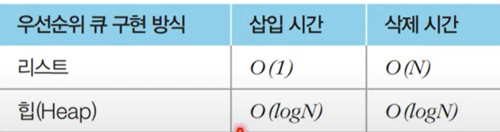
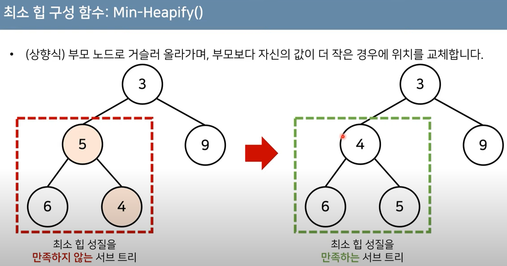
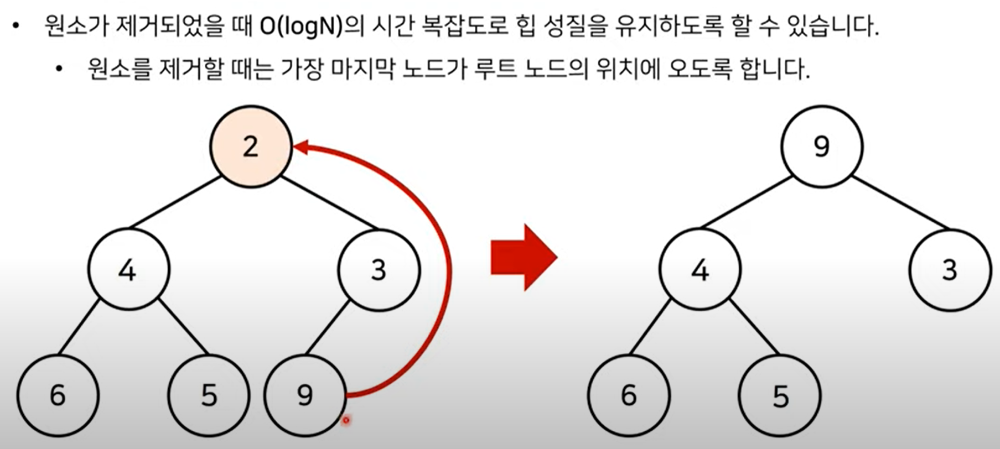

# etc 우선순위 큐

## 우선순위 큐

- 우선순위가 가장 높은 데이터를 가장 먼저 삭제하는 자료구조
- 우선순위에 따라 처리하고 싶을 때 사용
  - 물건 데이터를 자료구조에 넣었다가 가치가 높은 물건부터 꺼내서 확인하는 경우
- 스택
  - 가장 나중에 삽입된 데이터부터 출력
- 큐
  - 가장 먼저 삽입된 데이터부터 출력
- 우선순위 큐
  - 가장 우선순위가 높은 데이터 출력
- 구현 방법
  - 리스트를 이용해서 구현
  - 힙을 이용해서 구현
  

## 힙

- 완전 이진 트리 자료구조
- 항상 루트 노드를 제거한다.
- 최소 힙
  - 루트 노드가 가장 작은 값을 가진다
  - 값이 작은 데이터가 우선적으로 제거
- 최대 힙
  - 루트 노드가 가장 큰 값을 가진다
  - 값이 큰 데이터가 우선적으로 제거
  
  - 힙에서 원소가 생성될 때
    - Heapify 메서드를 통해서 새로운 원소가 삽입되어도 힙 성질을 유지할 수 있다.
  - 힙에서 원소가 제거될 때
    
    - 원소가 제거할 때는 가장 마지막 노드가 루트 노드의 위치에 오도록 한다
    - 이후 다시 Heapify 메서드를 통해서 힙 성질을 유지한다.
